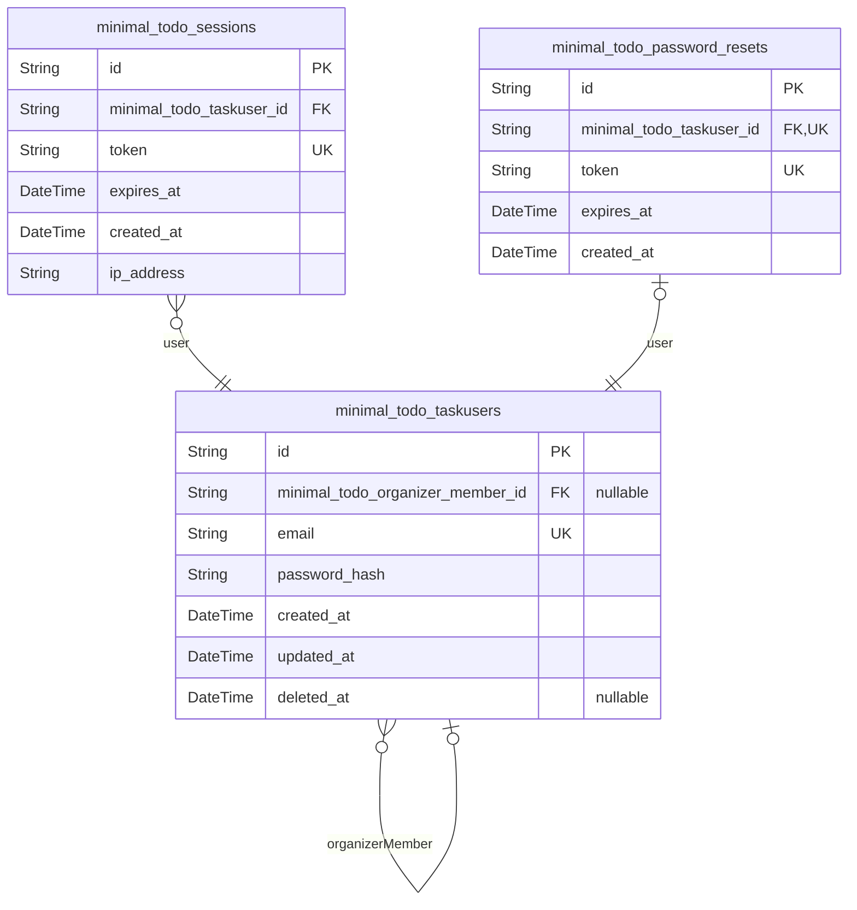
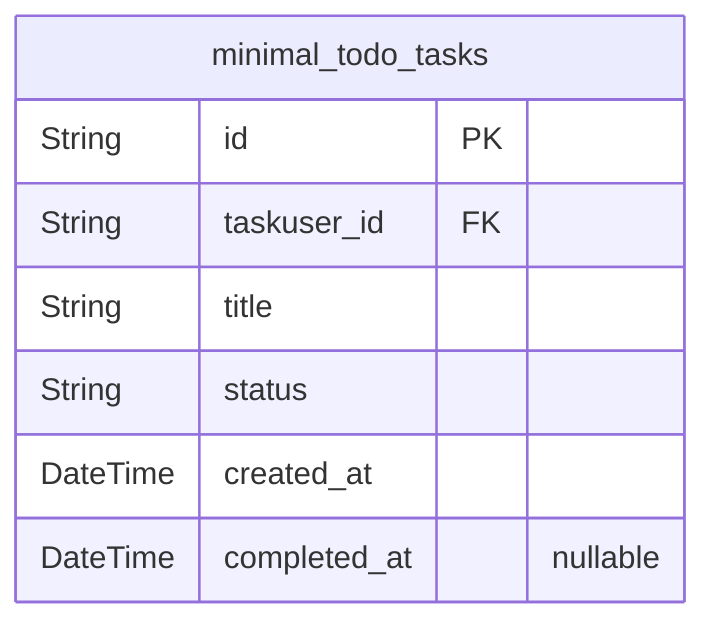

# Prisma Markdown

> Generated by [`prisma-markdown`](https://github.com/samchon/prisma-markdown)

- [Actors](#actors)
- [Tasks](#tasks)

## Actors

### `minimal_todo_taskusers`

User account information for authentication and identity management.
Stores essential details required for secure system access and account
recovery.

Properties as follows:

- `id`: Primary Key.
- `minimal_todo_organizer_member_id`
  > The organizer member associated with this user account {@link
  > minimal_todo_taskusers.id}. Links the user to their organizer membership
  > if applicable.
- `email`
  > Verified email address used for authentication and account recovery. Must
  > be unique across all users.
- `password_hash`
  > Securely hashed password using industry-standard algorithms. Never stored
  > or transmitted in plaintext.
- `created_at`: Timestamp when the user account was created.
- `updated_at`: Timestamp of the last account modification.
- `deleted_at`
  > Timestamp when the account was marked for deletion. Null for active
  > accounts.

### `minimal_todo_sessions`

Active user session tracking for authentication management. Maintains
security tokens and validity periods to control access to protected
resources.

Properties as follows:

- `id`: Primary Key.
- `minimal_todo_taskuser_id`
  > Belonged task user's [minimal_todo_taskusers.id](#minimal_todo_taskusers). References the
  > user account associated with this session.
- `token`
  > Cryptographically secure session token used for authentication. Must be
  > transmitted securely.
- `expires_at`: Timestamp when this session token expires and becomes invalid.
- `created_at`: Timestamp when the session was created.
- `ip_address`
  > IP address from which the session was initiated. Used for security
  > monitoring.

### `minimal_todo_password_resets`

Temporary tokens for secure password recovery process. Manages the
lifecycle of password reset requests with strict expiration policies.

Properties as follows:

- `id`: Primary Key.
- `minimal_todo_taskuser_id`
  > Associated task user's [minimal_todo_taskusers.id](#minimal_todo_taskusers). Links the reset
  > token to the user account requesting recovery.
- `token`: Single-use cryptographically secure token for password reset verification.
- `expires_at`
  > Timestamp when this reset token expires and becomes invalid (15 minutes
  > after creation).
- `created_at`: Timestamp when the reset request was initiated.

## Tasks

### `minimal_todo_tasks`

Core business entity representing user tasks in the minimalTodo
application. Contains essential information about intended work items
including title, status, and timestamps. Represents the fundamental value
proposition of the Todo application as a standalone entity that delivers
the primary user value. This model enables users to create, track, and
complete tasks with minimal complexity while preserving historical
context through timestamp tracking. All operations revolve around this
entity as it embodies the minimalist philosophy of the entire
application.

Properties as follows:

- `id`: Primary Key.
- `taskuser_id`: Belonged task user's [minimal_todo_taskusers.id](#minimal_todo_taskusers)
- `title`
  > Title of the task representing what needs to be done. Limited to 100
  > characters to ensure conciseness and compatibility with minimal interface
  > design.
- `status`
  > Current business status of the task with only two valid values:
  > 'incomplete' (default) and 'complete'. Maintains simplicity by avoiding
  > additional states consistent with minimal feature philosophy.
- `created_at`
  > Timestamp representing when the task was initially created. Preserved as
  > an immutable business record of when the user conceived the work item.
- `completed_at`
  > Timestamp recording when the task was marked complete. Used for
  > historical accuracy and completion tracking while maintaining business
  > integrity.
