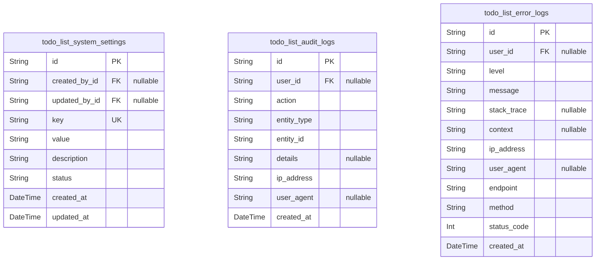
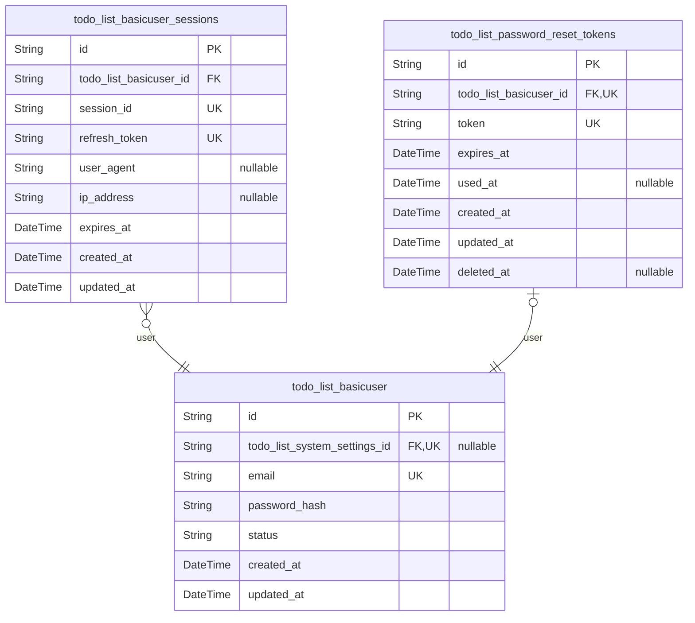
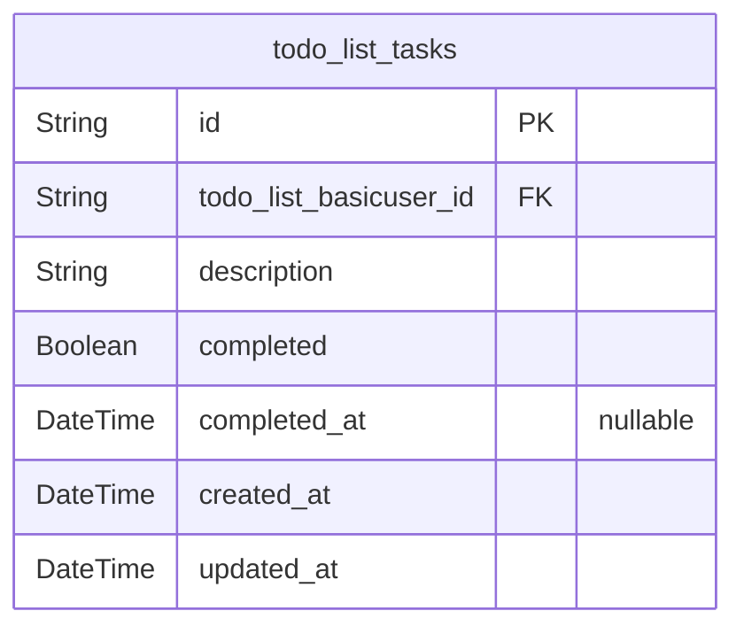

# Prisma Markdown

> Generated by [`prisma-markdown`](https://github.com/samchon/prisma-markdown)

- [Systematic](#systematic)
- [Actors](#actors)
- [Tasks](#tasks)

## Systematic

### `todo_list_system_settings`

Stores system-wide configuration settings that control application
behavior and features. These settings are managed by system
administrators and affect the entire application's operation.

Properties as follows:

- `id`: Primary Key.
- `created_by_id`: User who created this system setting. [todo_list_basicuser.id](#todo_list_basicuser).
- `updated_by_id`: User who last updated this system setting. [todo_list_basicuser.id](#todo_list_basicuser).
- `key`
  > Unique identifier for the system setting (e.g., 'maintenance_mode',
  > 'rate_limit'
- `value`: Value of the system setting (e.g., 'true', '1000', '2023-01-01')
- `description`: Description of what the system setting controls and its purpose
- `status`: Current status of the setting (active, inactive, deprecated)
- `created_at`: Timestamp when this setting was created
- `updated_at`: Timestamp when this setting was last updated

### `todo_list_audit_logs`

Records all significant security and administrative events within the
system for compliance and monitoring purposes. These logs capture who did
what and when for audit trail requirements.

Properties as follows:

- `id`: Primary Key.
- `user_id`: User responsible for the audited action. [todo_list_basicuser.id](#todo_list_basicuser).
- `action`
  > Type of action performed (e.g., 'login', 'password_reset',
  > 'settings_update')
- `entity_type`: Type of entity affected by the action (e.g., 'user', 'task', 'setting')
- `entity_id`: ID of the entity affected by the action
- `details`: Additional details about the action in JSON format
- `ip_address`: IP address from which the action was performed
- `user_agent`: Browser/Client user agent string
- `created_at`: Timestamp when this audit log was created

### `todo_list_error_logs`

Captures system errors and exceptions for monitoring, debugging, and
reliability improvement. These logs help identify issues and patterns in
system failures.

Properties as follows:

- `id`: Primary Key.
- `user_id`: User associated with the error context. [todo_list_basicuser.id](#todo_list_basicuser).
- `level`: Severity level of the error (error, warning, critical)
- `message`: Error message or exception message
- `stack_trace`: Full stack trace of the error in text format
- `context`: Additional context about the error in JSON format
- `ip_address`: IP address from which the error originated
- `user_agent`: Browser/Client user agent string
- `endpoint`: API endpoint or route where the error occurred
- `method`: HTTP method of the failed request
- `status_code`: HTTP status code returned with the error
- `created_at`: Timestamp when this error log was created

## Actors

### `todo_list_basicuser`

Core user entity for the todo list application that represents registered
users who can manage their tasks. This table stores essential user
information including authentication credentials and profile data.

Properties as follows:

- `id`: Primary Key.
- `todo_list_system_settings_id`: System settings configuration. [todo_list_system_settings.id](#todo_list_system_settings).
- `email`: Unique email address used for authentication and communication.
- `password_hash`: BCrypt hashed password for secure authentication.
- `status`: Current status of the user account (active, suspended, banned).
- `created_at`: Timestamp when the user account was created.
- `updated_at`: Timestamp when the user account was last updated.

### `todo_list_basicuser_sessions`

User session management table that stores active authentication sessions
for users. This supports the JWT-based authentication system by
maintaining refresh tokens and session state.

Properties as follows:

- `id`: Primary Key.
- `todo_list_basicuser_id`: Reference to the authenticated user. [todo_list_basicuser.id](#todo_list_basicuser).
- `session_id`: Unique identifier for the user session.
- `refresh_token`: Long-lived refresh token for maintaining user sessions.
- `user_agent`: User agent string identifying the client device/browser.
- `ip_address`: IP address from which the session was created.
- `expires_at`: Expiration timestamp for the session.
- `created_at`: Timestamp when the session was created.
- `updated_at`: Timestamp when the session was last updated.

### `todo_list_password_reset_tokens`

Temporary tokens used for password reset functionality that enable users
to recover access to their accounts when they forget their passwords.

Properties as follows:

- `id`: Primary Key.
- `todo_list_basicuser_id`
  > Reference to the user requesting password reset. {@link
  > todo_list_basicuser.id}.
- `token`: Cryptographically secure token for password reset verification.
- `expires_at`: Expiration timestamp after which the token becomes invalid.
- `used_at`: Timestamp when the token was used for password reset.
- `created_at`: Timestamp when the reset token was created.
- `updated_at`: Timestamp when the reset token was last updated.
- `deleted_at`: Soft delete timestamp for token revocation.

## Tasks

### `todo_list_tasks`

Stores individual tasks created by users in the todo list application.
Each task contains the description and completion status information.

Properties as follows:

- `id`: Primary Key.
- `todo_list_basicuser_id`: The user who created the task. [todo_list_basicuser.id](#todo_list_basicuser).
- `description`: The task description text entered by the user.
- `completed`: Indicates whether the task has been completed.
- `completed_at`: The timestamp when the task was marked as completed.
- `created_at`: The timestamp when the task was created.
- `updated_at`: The timestamp when the task was last updated.
