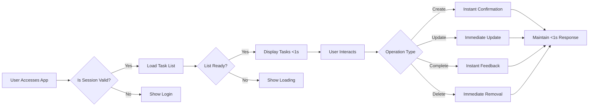

## Performance Expectations for Minimal Todo Application

WHEN a user creates a new task, THE system SHALL confirm completion instantly to provide immediate feedback on their action.

WHEN a user updates an existing task, THE system SHALL reflect the changes immediately in the task list without requiring manual refresh.

WHEN a user marks a task as complete, THE system SHALL update the interface instantly to show the completed status.

WHILE a user is managing multiple tasks, THE system SHALL maintain consistent responsiveness below 1 second for all operations.

THE application SHALL load the initial interface within 3 seconds of user access under normal network conditions.

WHEN a user returns to the application, THE system SHALL restore their previous session and task view within 2 seconds.

THE task list SHALL display all active tasks within 1 second of the user navigating to the main view.

WHILE the user is entering task details, THE system SHALL allow them to switch between fields without noticeable lag or delay.

IF the system experiences temporary performance issues, THEN THE system SHALL maintain basic task viewing functionality while other operations may be delayed.

WHERE network connectivity is intermittent, THE system SHALL cache user actions locally and synchronize when connection is restored.

WHEN the user is interacting with the application, THE interface SHALL feel responsive and instantaneous during all core operations.

THE system SHALL handle up to 100 tasks per user without degradation in user-perceived performance.

WHILE the user is scrolling through a long list of tasks, THE system SHALL maintain smooth scrolling without jank or stuttering.

THE search function SHALL return results instantly as the user types, with no noticeable delay between keystrokes and filtered display.

WHEN a user deletes a task, THE system SHALL remove it from view immediately and confirm the action without delay.

THE application SHALL remain available 99% of the time during business hours (9AM-6PM Korea Standard Time).

IF the system requires maintenance, THEN THE system SHALL notify users at least 24 hours in advance during business hours.

THE system SHALL recover from restart within 5 minutes to minimize user disruption.

WHEN a user accesses the application across different devices, THE system SHALL synchronize task data within 5 seconds of changes on any device.

THE mobile experience SHALL maintain equivalent responsiveness to desktop, ensuring consistent performance across platforms.

> *Developer Note: This document defines **business requirements only**. All technical implementations (architecture, APIs, database design, etc.) are at the discretion of the development team.*