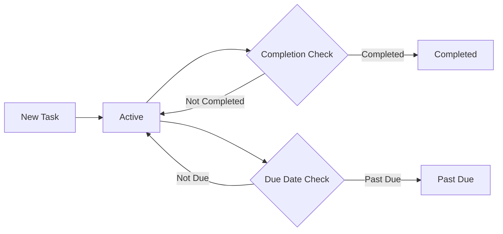

## Terminology Definitions for Minimal Todo Application

### Task Terminology

#### Task
A business entity representing a discrete unit of work that a user needs to accomplish. In the context of this minimal application:

- **Definition**: A user-defined item containing essential information about intended work
- **Business Purpose**: Enables users to track and manage actionable items
- **Key Components**:
  - Title: Primary description of the work item (business term: "What needs to be done")
  - Description: Optional additional details about the task (business term: "How to accomplish")
  - Due Date: Optional target completion date (business term: "When it should be finished")
  - Completion Status: Business state indicating whether the task has been accomplished

#### Task Lifecycle
A sequence of business states a task progresses through during its useful life:

### User Action Definitions

#### Create Task
The business process of adding a new actionable work item to the user's task list.

- **Business Trigger**: WHEN a user decides to record something they need to do
- **Business Requirements**:
  - THE system SHALL require a title for all new tasks
  - THE system SHALL allow an optional description of up to 1,000 characters
  - THE system SHALL accept a due date in business calendar format (YYYY-MM-DD)
  - IF the title exceeds 100 characters, THEN THE system SHALL truncate and notify the user
  - IF an invalid date format is provided, THEN THE system SHALL reject the input with specific guidance

#### Read Task
The business process of viewing task information in a meaningful way.

- **Business Trigger**: WHEN a user needs to check their pending work items
- **Business Requirements**:
  - THE system SHALL display tasks in order of urgency (due date proximity)
  - THE system SHALL visually distinguish completed tasks from active ones
  - THE system SHALL show due dates in relative terms ("Today", "Tomorrow", "This Week")
  - WHILE viewing tasks, THE system SHALL allow sorting by due date or creation time

#### Update Task
The business process of modifying task details before completion.

- **Business Trigger**: WHEN a user needs to change task details
- **Business Requirements**:
  - THE system SHALL allow editing of title, description, and due date
  - THE system SHALL maintain task creation timestamp as immutable business record
  - WHERE task completion status is active, THE system SHALL allow all modifications
  - WHEN updating to completed status, THE system SHALL record completion timestamp
  - IF changes would create duplicate titles, THEN THE system SHALL allow it (business scenario: multiple tasks for same general item)

#### Delete Task
The business process of removing a task from active consideration.

- **Business Trigger**: WHEN a user determines a task is no longer relevant
- **Business Requirements**:
  - THE system SHALL require explicit confirmation before permanent deletion
  - THE system SHALL not allow deletion of completed tasks (business retention policy)
  - WHEN a task is deleted, THE system SHALL remove it from all views immediately
  - THE system SHALL NOT provide task recovery functionality (minimal implementation scope)

### Status Terminology

#### Active Status
The business state indicating a task requires attention and has not been completed.

- **Business Definition**: A work item that is currently relevant and requires user action
- **Business Rules**:
  - THE system SHALL consider tasks with completion status "incomplete" as active
  - WHILE today's date is before due date, THE system SHALL designate task as "on track"
  - WHEN today's date matches due date, THE system SHALL designate task as "due today"

#### Completed Status
The business state indicating a task has been successfully accomplished.

- **Business Definition**: A work item that has been finished to user satisfaction
- **Business Rules**:
  - THE system SHALL record exact completion timestamp when status changes
  - THE system SHALL exclude completed tasks from primary task view by default
  - WHILE displaying completed tasks, THE system SHALL show completion date
  - THE system SHALL NOT allow modification of completed tasks (business integrity)

#### Past Due Status
The business state indicating a task remains incomplete beyond its intended deadline.

- **Business Definition**: A work item that requires attention but missed its target completion date
- **Business Rules**:
  - WHEN current date is after task due date AND status is active, THE system SHALL designate as past due
  - THE system SHALL prioritize past due tasks in business logic
  - THE system SHALL NOT automatically complete past due tasks (user action required)
  - WHILE displaying past due tasks, THE system SHALL highlight elapsed time beyond due date

### Business Rule Terms

#### Minimum Viable Task
The simplest business representation of a work item that provides user value:

- **Business Definition**: A task containing only the essential information required for action
- **Business Logic**:
  - THE system SHALL consider a task viable with title only
  - THE system SHALL NOT require description or due date as business essentials
  - ONLY title constitutes the minimum business requirement for task creation

#### Task Uniqueness
The business principle governing how tasks are distinguished from each other.

- **Business Definition**: Each task is unique based on user context and creation time
- **Business Logic**:
  - THE system SHALL allow duplicate titles within a user's task list (business reality: users may have multiple identical tasks)
  - THE system SHALL distinguish tasks through business-unique identifier not visible to users
  - WHEN sorting tasks, THE system SHALL use due date as primary business factor

### System Component Vocabulary

#### Task List
A business collection of user's actionable work items:

- **Business Definition**: The primary user interface for task management
- **Business Context**:
  - THE system SHALL present active tasks as the default business view
  - THE system SHALL limit business view to user's own tasks only (no sharing capability)
  - WHILE the list contains items, THE system SHALL show count of active tasks
  - THE system SHALL update the list in real-time business perspective

#### Completion Action
The business process of marking work as finished:

- **Business Definition**: The transition from active to accomplished state
- **Business Logic**:
  - WHEN a user indicates completion, THE system SHALL record exact timestamp
  - THE system SHALL prevent retroactive completion date modification
  - AFTER completion, THE system SHALL remove task from active business workflows

### Cross-Document Consistency Markers

#### Universal Task ID
A business reference used to maintain consistency across documentation:

- **Business Convention**: All documents SHALL refer to tasks using consistent business terminology
- **Usage Rules**:
  - In business documents: refer to as "task" or "user task"
  - NEVER use technical terms like "record" or "entry"
  - ALWAYS describe status transitions in business terms: "marked complete" not "status=1"

#### Business Time Reference
Standardized business temporal reference for consistent requirements:

- **Business Convention**: All time references SHALL use user's local business time
- **Application**:
  - WHEN documenting due dates: specify "business day" not technical timestamp
  - WHERE time sensitivity applies: describe in user experience terms ("immediate", "instant")
  - THE system SHALL align with Asia/Seoul timezone as business operational zone

## Developer Autonomy Statement

> *Developer Note: This document defines **business requirements only**. All technical implementations (architecture, APIs, database design, etc.) are at the discretion of the development team.*